# Basketball-Action-Recognition
Spatio-Temporal Classification of 🏀 Basketball Actions using 3D-CNN Models trained on the SpaceJam Dataset.

LeBron shooting over Deandre Jordan

## Motivation
Utilizing the SpaceJam Basketball Action Dataset [Repo](https://github.com/simonefrancia/SpaceJam), I aim to create a model that takes a video of a basketball game to classify a given action for each of the players tracked with a bounding box. There are two essential parts for this program: R(2+1)D Model (Can be any 3D CNN architecture) and the player tracking. The deep learning framework used to train the network was PyTorch and the machine used to train the model was the Nvidia RTX 3060ti GPU.

This is a demo video from the SpaceJam Repo.

[Demo Video](https://www.youtube.com/watch?v=PEziTgHx4cA)

## Action/Video Classification
A pretrained baseline R(2+1)D CNN (pretrained on kinetics-400 dataset) from [torchvision.models](https://pytorch.org/vision/0.8/models.html) is used and further fine-tuned on the SpaceJam dataset. Any 3D CNN architecture can be used, but for this project it was decided that the R(2+1)D was a perfect balance in terms of number of parameters and overall model performance. It was also shown in the [paper](https://arxiv.org/pdf/1711.11248.pdf) that factorizing 3D convolutional filters into separate spatial and temporal dimensions, alongside residual learning yields significant gains in accuracy. The training was done at [train.py](https://github.com/hkair/Basketball-Action-Recognition/blob/master/train.py).

### Dataset
As mentioned above, the SpaceJam Basketball Action Dataset was used to train the R(2+1)D CNN model for video/action classification of basketball actions. The [Repo](https://github.com/simonefrancia/SpaceJam) contains two datasets (clips->.mp4 files and joints -> .npy files) of basketball single-player actions. The size of the two final annotated datasets is about 32'560 examples. Custom dataloaders were used for the basketball dataset in the [dataset.py](https://github.com/hkair/Basketball-Action-Recognition/blob/master/dataset.py).

#### Augmentations
After reading the thesis [Classificazione di Azioni Cestistiche mediante Tecniche di Deep Learning](https://www.researchgate.net/publication/330534530_Classificazione_di_Azioni_Cestistiche_mediante_Tecniche_di_Deep_Learning), (Written by Simone Francia) it was determined that the poorest classes with examples less than 2000 examples were augmented. Dribble, Ball in Hand, Pass, Block, Pick and Shoot were among the classes that were augmented. Augmentations are applied by running the script [augment_videos.py](https://github.com/hkair/Basketball-Action-Recognition/blob/master/augment_videos.py) and saved in a given output directory. Translation and Rotation were the only augmentations applied. After applying the augmentations the dataset has 49901 examples.

##### Rotate
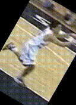
##### Translate
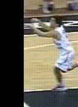

### Training
- The training was done at [train.py](https://github.com/hkair/Basketball-Action-Recognition/blob/master/train.py). The training was run for 25 epochs and with a batch size of 8 epoch. The model was trained with the classic 70/20/10 split. Where 70% of the data was use to train and 20% was used to validate the model. And, the rest of the 10% was used in the inference to test the final model. It was found that a learning rate of 0.0001 was better than a learning rate of 0.001.

#### Checkpointing
Both history and checkpointing is done after every epoch with [checkpoints.py](https://github.com/hkair/Basketball-Action-Recognition/blob/master/utils/checkpoints.py) in the utils directory.

### Validation and Evaluation
The final model was a R(2+1)D CNN trained on the additional augmented examples. For validation on the test set, the model at epoch 19 was used as it was the best performing model in terms of validation f1-score and accuracy. The model performs significantly better than the reported 73% in the thesis [Classificazione di Azioni Cestistiche mediante Tecniche di Deep Learning](https://www.researchgate.net/publication/330534530_Classificazione_di_Azioni_Cestistiche_mediante_Tecniche_di_Deep_Learning), acheiving 85% for both validation accuracy and test accuracy. The confusion matrix was attained using the [inference.py](https://github.com/hkair/Basketball-Action-Recognition/blob/master/inference.py) code. Further analysis on predictions and errors are done on [error_analysis.ipynb](https://github.com/hkair/Basketball-Action-Recognition/blob/master/error_analysis.ipynb) notebook.

#### Confusion Matrix 

0: Block, 1: Pass, 2: Run, 3: Dribble, 4: Shoot, 5: Ball in Hannd, 6: Defence, 7: Pick, 8: No Action, 9: Walk

##### Test on Training and Validation Set
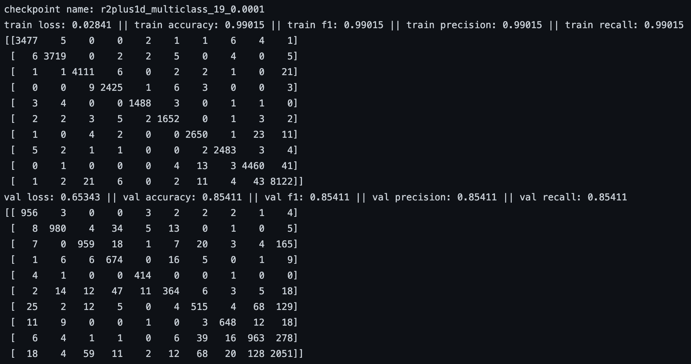

##### Testing on the 10% of the leftover data.
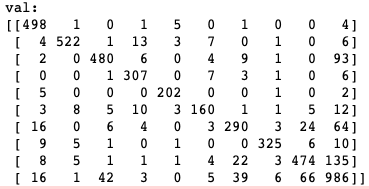

#### Inference Examples

|   State   |   Shooting   |   Dribble   |   Pass   |   Defence   |   Pick   |   Run   |   Walk   |   Block   |   No Action   |
:----------:|:------------:|:-----------:|:--------:|:-----------:|:--------:|:-------:|:--------:|:---------:|:--------------:
True | 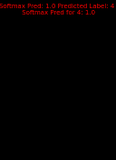 | 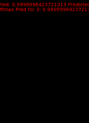 | 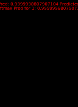 | 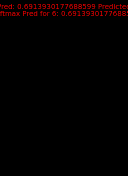 | 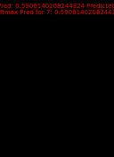 | 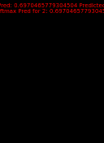 | 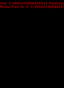 |  | 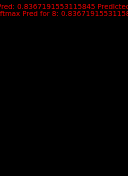
False |  | 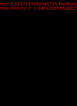 | 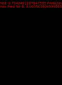 | 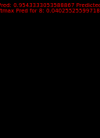 | 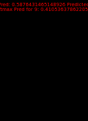 | 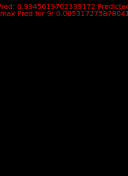 | 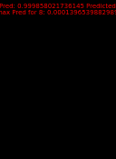 |  | 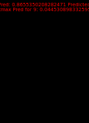

## Player Tracking 
All player tracking is done in [main.py](https://github.com/hkair/Basketball-Action-Recognition/blob/master/main.py). Players are tracked by manually selecting the ROI using the opencv TrackerCSRT_create() tracker. In theory, an unlimited amount of people or players can be tracked, but this will significantly increase the compute time. In the example above only 2 players, LeBron James (Offence) & Deandre Jordan (Defence) were tracked.

## Output
After extracting the bounding boxes from TrackerCSRT_create(), a cropped clip of 16 frames is used to classify the actions. The 16 frame length clip is determined by the vid_stride (Set to 8 in the example video above) which is set in the cropWindows() function in . 

## Future Additions
- Separate augmented examples from validation and only in training.
- Utilize better player tracking methods. 
- Restrict Box size to 176x128 (Or with similar Aspect Ratio), so resize of image is not applied.
- Fully automate player tracking. Potentially using YOLO or any other Object Detection Models.
- Play around with hyperparameters such as learning rates, batch size, layers frozen, etc.
- Try various 3D-CNN Architectures or sequential models such as CONV-LSTMs.

## Credits
Major thanks to [Simone Francia](https://github.com/simonefrancia) for the basketball action dataset and paper on action classification with 3D-CNNs. 
